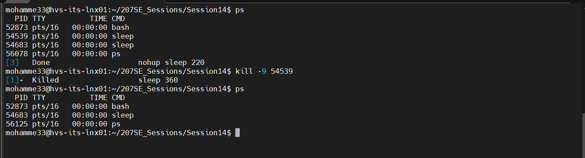
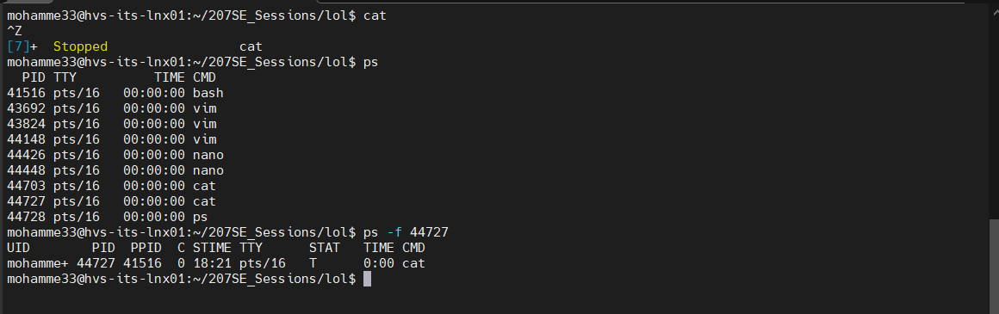
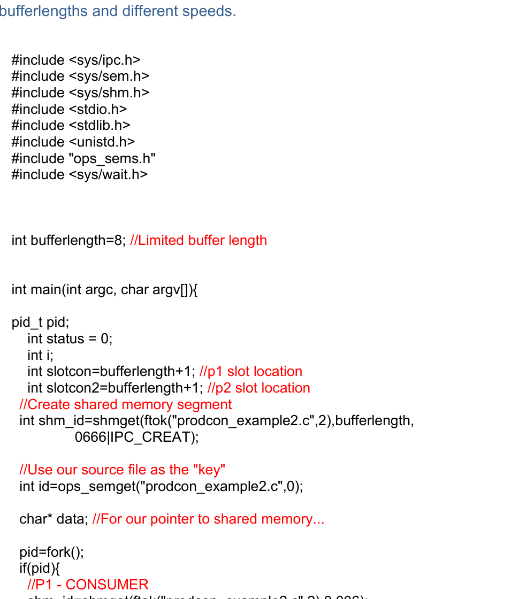
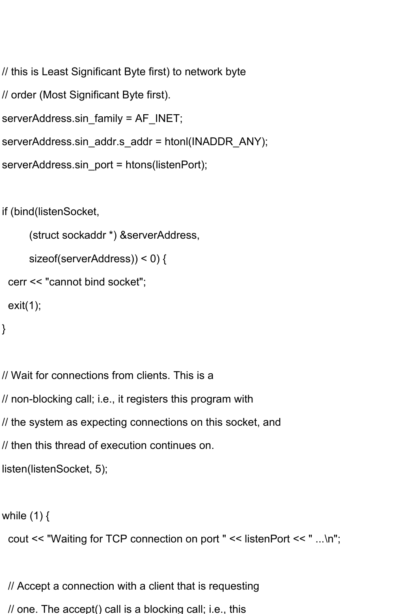

# Linux and Network Programming Foundations

## Overview

This repository presents selected work from my **207SE Operating Systems, Security and Networks** university module.

The portfolio exercises covered Linux command-line use, process management, inter-process communication, shared memory, semaphores and TCP socket programming.

> This is a technical foundations project. It is not presented as advanced software engineering; the value is in showing familiarity with the operating-system and networking concepts that security analysts regularly encounter when investigating hosts and network activity.

## Why This Matters for Security Analyst Roles

A SOC or Security Analyst often needs to understand what is happening beneath a security tool's interface.

These exercises demonstrate useful foundations for:

- reading and interpreting Linux processes
- understanding parent / child process relationships
- recognising foreground and background execution
- understanding how processes communicate
- recognising shared-memory and synchronisation concepts
- understanding TCP client/server communication
- interpreting listening ports and socket connections
- reading basic C / C++ systems code

## Lab 1 — Linux Process and Job Control

The coursework included practical work with:

- `fork()`
- `execl()`
- `ps`
- foreground / background jobs
- process suspension and termination
- `nohup`
- `disown`
- `screen`
- `watch`

One exercise used `fork()` to create a parent and child process, then used `execl()` to replace the child process with selected Linux commands.

This is useful analyst knowledge because suspicious Linux activity is often investigated through **process trees, process IDs, command lines and parent/child relationships**.

### Practical evidence — process inspection and termination



The terminal evidence shows running processes being enumerated with `ps`, a process terminated using its PID, and the process list checked again to verify the change.

### Practical evidence — process state inspection



This example shows a stopped process and the use of `ps -f` to inspect its PID, parent PID and process state.

See [linux-process-management.md](docs/linux-process-management.md).

## Lab 2 — Inter-Process Communication and Synchronisation

The portfolio included exercises involving:

- semaphores
- shared memory
- producer / consumer logic
- process synchronisation

The producer/consumer exercise used shared memory and semaphore operations to coordinate two processes accessing a limited buffer.

These are important foundations for understanding how software components interact and why race conditions or poorly controlled shared resources can cause reliability and security issues.

### Practical evidence — producer / consumer shared memory



This code demonstrates creation of a shared-memory segment, semaphore use and `fork()` to separate producer and consumer execution.

See [ipc-and-synchronisation.md](docs/ipc-and-synchronisation.md).

## Lab 3 — TCP Server Programming

The strongest networking exercise involved a TCP server representing a pharmaceutical company receiving requests from client systems.

The server code demonstrated:

- creating a socket with `socket()`
- binding to a local port with `bind()`
- listening for incoming connections with `listen()`
- accepting a client with `accept()`
- identifying the client's IP address and source port
- receiving data with `recv()`
- returning data with `send()`

### Practical evidence — TCP server socket workflow



The server-side code shows address configuration, `bind()`, `listen()` and the logic used to wait for incoming TCP connections.

See [tcp-server-foundations.md](docs/tcp-server-foundations.md).

## Additional Evidence

The `evidence/` folder also contains supporting screenshots for:

- background execution using `nohup`
- semaphore-controlled critical sections
- further Linux process-control activity

These are retained as supporting evidence without overloading the main README.

## Security Analyst Interpretation

### Example: Unexpected Listening Service

If an analyst discovers an unknown process listening on a Linux server, the concepts demonstrated here help answer:

1. Which process owns the socket?
2. Which port is it listening on?
3. Is the process a child of another suspicious process?
4. Which remote IPs are connecting?
5. What data is being sent or received?

That turns low-level operating-system knowledge into practical investigation context.

## Technical Concepts Demonstrated

| Coursework Concept | Security Relevance |
|---|---|
| Linux permissions and command line | Host investigation and administration |
| Process creation with `fork()` | Process-tree analysis |
| `exec` family | Understanding process replacement / execution |
| Job control | Interpreting process states |
| Shared memory | Understanding IPC between processes |
| Semaphores | Synchronisation and race-condition concepts |
| TCP sockets | Understanding listening services and network connections |
| IP addresses and ports | Network investigation fundamentals |
| `recv()` / `send()` | Understanding application-layer communication flow |

## Retrospective

These exercises were completed early in my degree and reflect my technical level at that time.

With my current cybersecurity perspective, I would improve the work by:

- adding stronger input validation and error handling
- using clearer comments and cleaner code structure
- testing socket behaviour with tools such as `ss`, `netstat`, `tcpdump` or Wireshark
- documenting expected network flows
- adding logging around connections and failures
- explaining how process and socket evidence would appear during a security investigation

The repository intentionally preserves the scope of the original coursework rather than presenting the exercises as production-quality software.

## Repository Structure

```text
.
├── README.md
├── docs/
│   ├── linux-process-management.md
│   ├── ipc-and-synchronisation.md
│   └── tcp-server-foundations.md
└── evidence/
    ├── 01-linux-process-control.png
    ├── 02-background-nohup-job.png
    ├── 04-process-state-inspection.png
    ├── 05-semaphore-critical-section.png
    ├── 06-producer-consumer-shared-memory.png
    └── 07-tcp-server-listening-code.png
```
